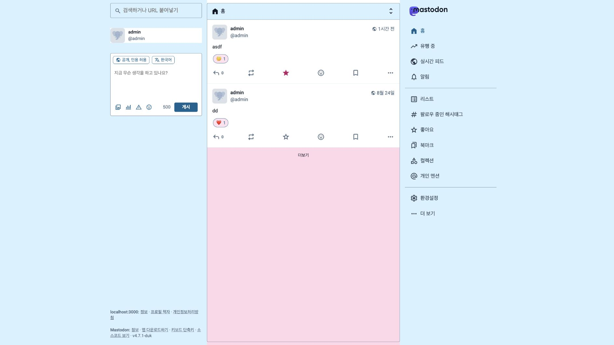
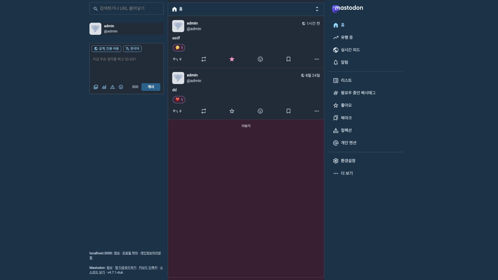
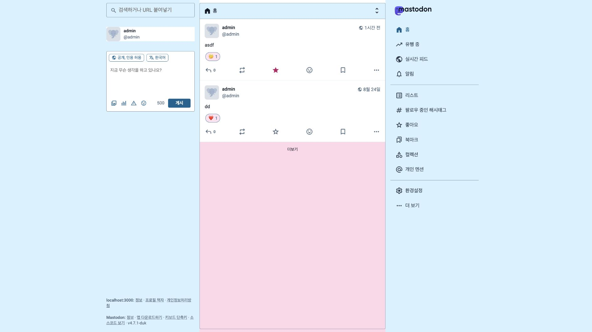
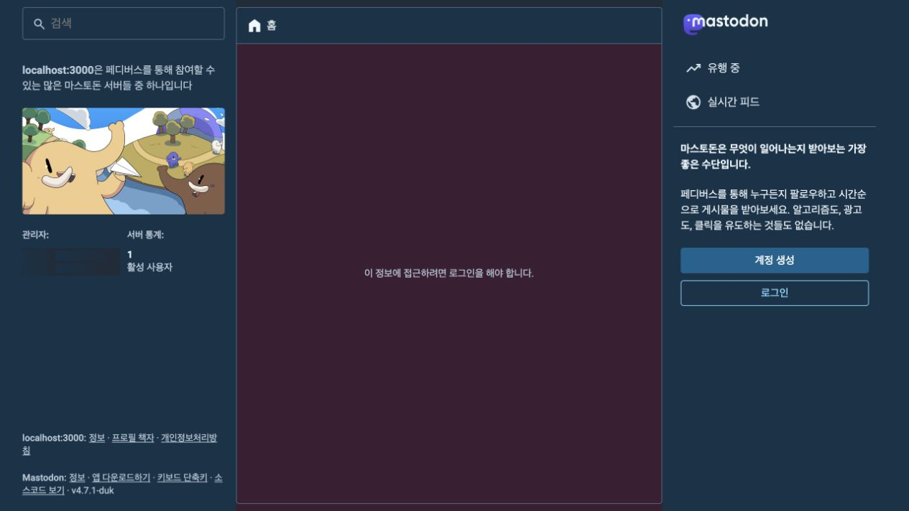
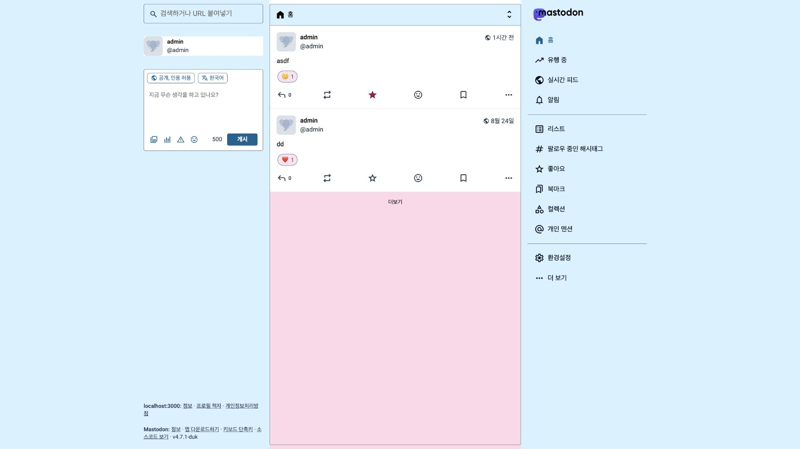

# Sky Blossom theme

Sky Blossom is an optional color theme for Mastodon v4.7.1. It keeps the
default Mastodon layout, typography, and component styles while combining
white reading cards with equally prominent sky-blue and blossom-pink surfaces.

## How the theme is loaded

Mastodon reads available theme names and entrypoints from `config/themes.yml`.
The Mastodon Vite plugin exposes each entry as a virtual `themes/<name>`
stylesheet, and `theme_style_tags` includes the active theme in the page layout.

The active theme is selected in this order:

1. The signed-in user's theme, when it is valid.
2. The theme selected by the administrator for the site.
3. Mastodon's `default` theme.

Sky Blossom imports the default `styles/application.scss` entrypoint and then
overrides only CSS custom properties. Error, warning, and success palettes stay
unchanged so semantic feedback remains distinct from the pink decorative and
selection accents.

The surface system targets an approximate 1:2:2 white/sky/pink visual ratio.
In light mode, sky forms the page canvas, pink frames the main working area,
and white carries dense reading content. Dark mode preserves that rhythm with
a deep sky canvas, a plum-pink working area, and neutral cards with white text.
Pink also remains the favourite, selection, and rich-text accent. Repeated feed
rows retain quiet decorative dividers while meaningful container and control
borders meet the non-text contrast target. High contrast strengthens those
boundaries without making the interface feel outlined.

Color scheme and contrast are separate preferences. Their resolved values are
exposed through the `data-color-scheme` and `data-contrast` HTML attributes, so
the same theme supports Auto, Light, Dark, and High contrast preferences.

## Test locally with Storybook

Run the component gallery and select the Light or Dark toolbar option:

```shell
yarn storybook
```

For a full application check, use the development container:

```shell
docker compose -f .devcontainer/compose.yaml up -d
docker compose -f .devcontainer/compose.yaml exec app bin/setup
docker compose -f .devcontainer/compose.yaml exec app bin/dev
```

After the processes are ready, open <http://localhost:3000> and select **Sky
Blossom** under **Preferences > Appearance > Theme**. Use **Administration >
Server settings > Design** to make it the default for signed-out visitors.

`config/themes.yml` is loaded by Rails, so restart `bin/dev` after adding or
renaming a theme. Once registered, edits to `sky_blossom.scss` are updated by
the Vite development server without a full asset precompile.

## Visual and accessibility checklist

Test Light and Dark schemes with both Default and High contrast. Also test Auto
while switching the operating system color scheme.

Check these surfaces at desktop and mobile widths:

- Home timeline and composer
- Posts with media, polls, content warnings, and selected actions
- Notifications
- Preferences and administration forms
- Signed-out and authentication pages
- Errors, warnings, success messages, focus rings, and disabled controls

The minimum rendered contrast across the white, sky, and pink surface roles is:

| Combination                        |   Light | Light high |    Dark | Dark high |
| ---------------------------------- | ------: | ---------: | ------: | --------: |
| Primary text / large surfaces      | 13.71:1 |    16.15:1 | 12.03:1 |   12.66:1 |
| Secondary text / large surfaces    |  4.52:1 |     9.21:1 |  7.81:1 |    7.81:1 |
| Brand text / large surfaces        |  5.04:1 |     5.04:1 |  8.04:1 |    8.04:1 |
| White text / primary brand button  |  6.55:1 |     6.55:1 |  6.55:1 |    6.55:1 |
| Favourite icon / large surfaces    |  4.69:1 |     6.47:1 |  6.33:1 |    6.33:1 |
| Meaningful border / large surfaces |  3.12:1 |     4.52:1 |  3.25:1 |    5.14:1 |
| Rich text / rich-text surface      |  9.15:1 |     9.15:1 |  8.16:1 |    8.16:1 |

Normal text and links exceed WCAG AA's 4.5:1 target, and meaningful control
boundaries exceed the 3:1 non-text target in every explicit mode. Screenshot
checks cannot prove keyboard order, assistive-technology output, or every
runtime state, so those still require an interactive full-application pass.

## Visual reference

### Light and dark desktop surfaces







### High-contrast states





## Production deployment

After deploying the theme files, compile production assets and restart all
Mastodon processes:

```shell
RAILS_ENV=production bundle exec rails assets:precompile
```

No database migration is required. After restart, confirm that signed-out
visitors receive the administrator's site theme and existing users keep their
personal theme choices.
